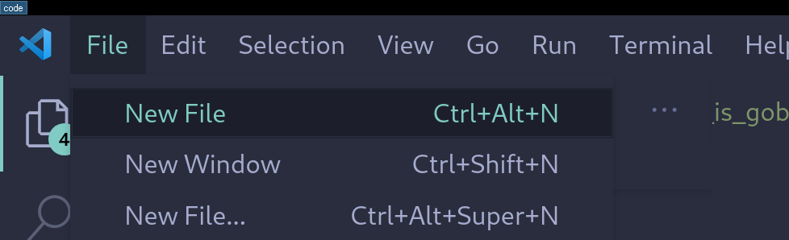
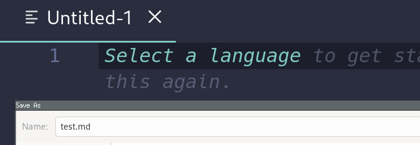

# Installing gobook

This will get you set up to learn Go in the fastest way possible with interactive exercises to help you dive in quickly.

### Install software (if you don't already have it)

1) [Download Go here](https://golang.org/doc/install)
2) [Download VS Code here](https://code.visualstudio.com/)
3) [Download the Extension here](https://marketplace.visualstudio.com/items?itemName=gobookdev.gobook)

### Test extension
1) Create a new file

2) Save it as test.md

