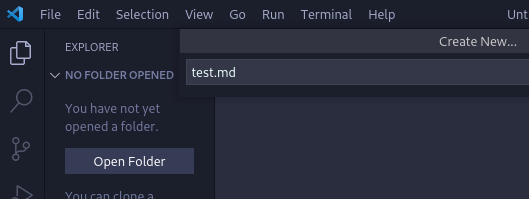
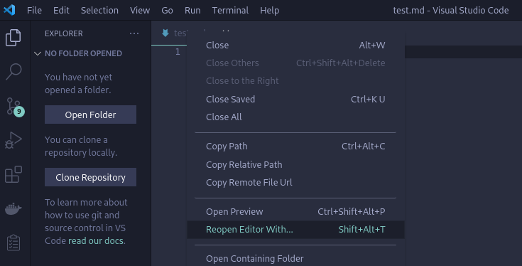
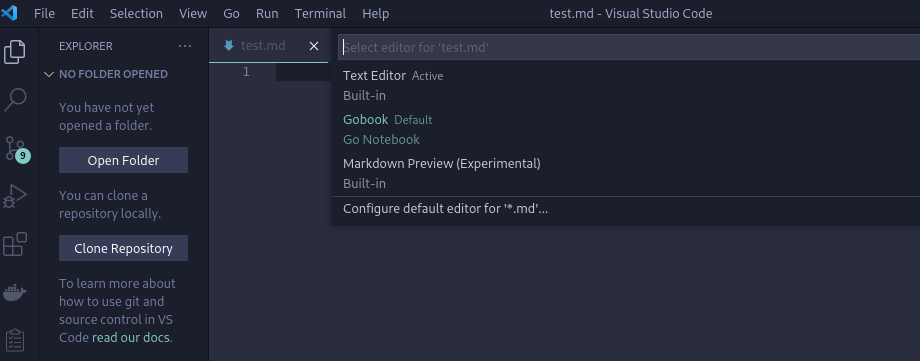
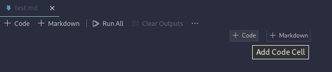
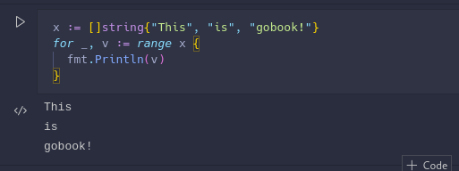
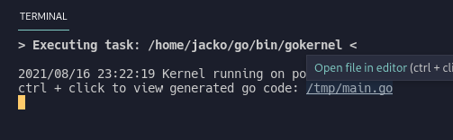
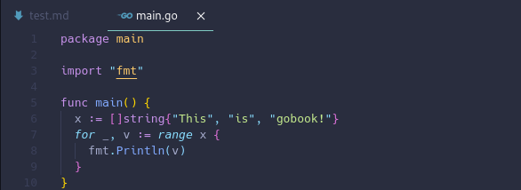
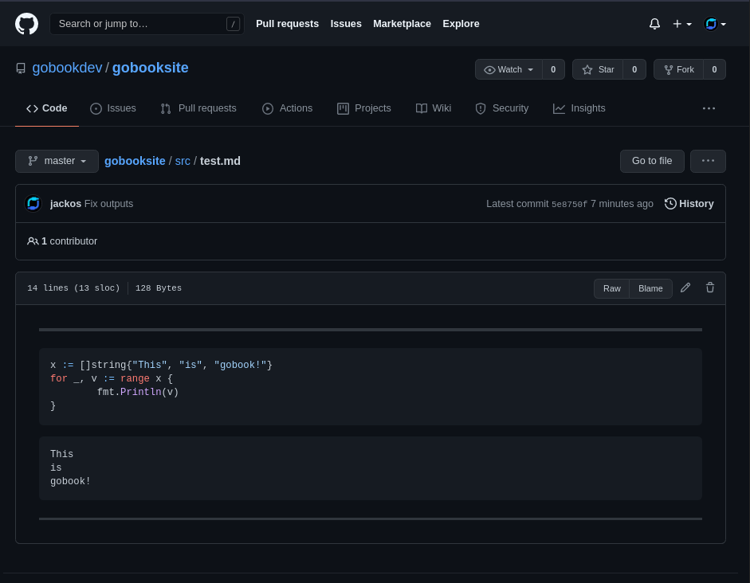

# Installing gobook

This will allow you to start playing with go in the fastest way possible

### Install software

1) [Download Go here](https://golang.org/doc/install)
2) [Download VS Code here](https://code.visualstudio.com/)
3) [Download the Extension here](https://marketplace.visualstudio.com/items?itemName=gobookdev.gobook)

### Test extension
1) Create a new file called test.md

2) If the extension doesn't active right click test.md and select reopen with, then Gobook:

3) Add a code cell

4) Run some code

5) ctrl + click the file name in terminal to view generated code

6) Upload test.md to Github for a niceley rendered markdown document, with outputs retained

