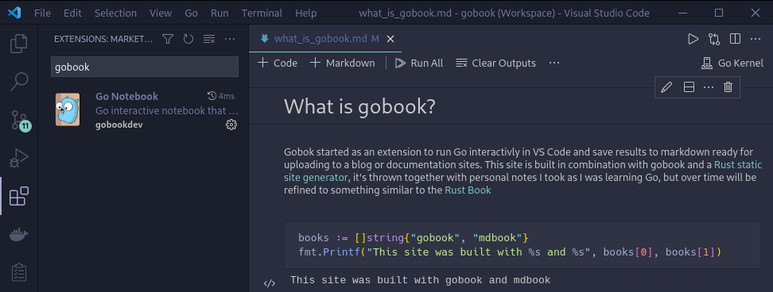

# What is gobook?

Gobok started as an extension to run Go interactivly in VS Code and save results to markdown ready for uploading to a blog or documentation sites. This site is built in combination with gobook and a [Rust static site generator](https://github.com/rust-lang/mdBook), it's thrown together with personal notes I took as I was learning Go, but over time will be refined to something similar to the [Rust Book](https://doc.rust-lang.org/book/)

## Example Output

---
```go
books := []string{"gobook", "mdbook"}
fmt.Printf("This site was built with %s and %s", books[0], books[1])
```
```output
This site was built with gobook and mdbook
```
---
- [Go Notebook Extension](https://marketplace.visualstudio.com/items?itemName=gobookdev.gobook) 
- [Github - Extension](https://github.com/gobookdev/gobook)
- [Github - Go kernel](https://github.com/gobookdev/gokernel)
- [Github - this site](https://github.com/gobookdev/gobooksite)


